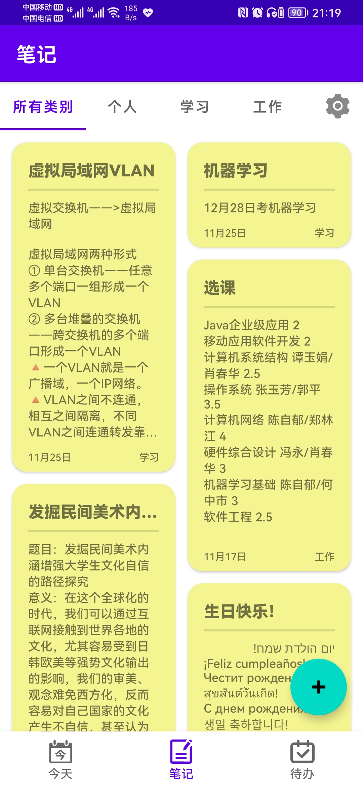
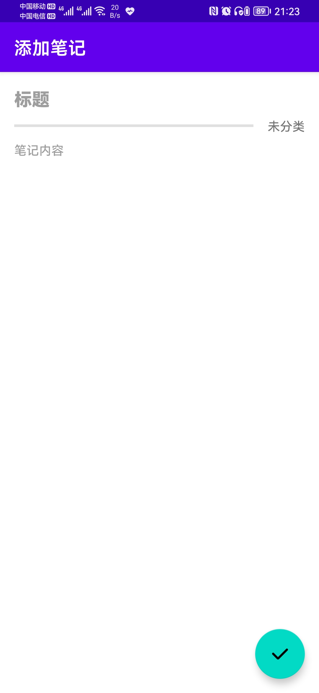

# Android-Application-DailyNotes
重庆大学2019级计算机学院移动应用开发期末项目：Android每日笔记

Android Studio Chipmunk | 2021.2.1 Patch 1

Gradle Version: 7.0.2

Compile Sdk Version: API 31(Android 12.0)

Dependency:

com.contrarywind:Android-PickerView:4.1.9（滚动选择器）

首页信息来源：聚合数据万年历API和历史上的今天API（请在聚合数据 https://www.juhe.cn/docs/api/id/177 和 https://www.juhe.cn/docs/api/id/63 申请key并替换app/src/main/java/com/cqu/notes/ui/home/HomeFragment.java第126行和130行中的“******”）

(源码和资源在app/src/main)

#### 软件设计意图、功能介绍和特色
生活中我们经常会遇到一些场景需要我们记一些笔记，并将这些笔记归类，方便之后查看。另外，将计划要做的任务整理成待办列表有助于我们安排和规划时间，也方便记录完成情况。基于这些需求，我设计了“每日笔记”APP，实现了这些功能。本应用主要分为三个部分：
1. “今天”：该页从网络获取并展示了当日的各种信息，包括年月日星期、节假日、农历日期、黄历以及历史上的今天事件列表。

-|-
:-------------------------:|:-------------------------:
 | 

2. “笔记”：该页展示了记录的笔记，并按照设置的类别分类，按修改时间排序。可以进行添加、删除和修改笔记操作。对类别可以进行增加、修改、删除和自定义排序操作。

-|-
:-------------------------:|:-------------------------:
 | 

3. “待办”：该页展示了待办事项，每个条目都有事件标题、事件时间和完成标记。待办事项可以进行添加、删除、修改操作。待办条目按照完成情况和事件时间排序。

-|-
:-------------------------:|:-------------------------:
 | 

特色：适配了深色模式、每个RecyclerView都有进入动画。条目使用了圆角矩形，添加、删除、排序、修改都有动画。

#### 设计说明
本应用有三个Activity和可变数量的Fragment，EditNotesActivity用于添加和编辑笔记；TypeSetActivity用于编辑类别。MainActivity的ViewPager包含多个个Fragment，每个Fragment展示某一种类别的笔记列表，笔记按最后编辑时间排序。

database包含有操作数据库的方法，以及存放进数据库的类NotesItem，笔记类别、笔记条目、待办事项都以NotesItem类的形式存放在数据库，通过type变量进行区分。ui包用以控制界面，其中home包控制“今天”页，HomeFragment是页面碎片，HistoryAdapter和HistoryItem是历史上的今天RecyclerView列表的适配器以及其中条目的类；notes包控制“笔记”页，NotesFragment是该页页面碎片，NotesPageAdapter和NotesPage是ViewPager的适配器和页面类，NotesAdapter是笔记RecyclerView的适配器，EditNotesActivity和TypeSetActivity实现笔记编辑页和笔记类别编辑页；todo包控制“待办”页，TodoFragment是该页页面碎片，TodoAdapter是待办事项RecyclerView的适配器。util包存放网络请求工具类RequestUtil。MainActivity控制主界面，在笔记页点击添加按钮或点击某条笔记会跳转到笔记编辑EditNotesActivity，而点击右上角设置图标会跳转到类别编辑TypeSetActivity，页面跳转通过Intent传递参数。

#### 实验成果
打开应用后首先进入的是“今天”页，该页展示了当日的基本信息，包括年月日星期、节假日、农历日期、黄历和历史上的今天发生的事件，历史上的今天部分可以上下滑动。其中黄历和历史上的今天是从网络获取并以JSON字符串的形式通过SharedPreferences存储在本地。当创建这一页Fragment时如果当前日期与本地存储中的相同则从本地读取详细信息并展示，否则从网络获取并覆盖本地信息、更新本地存储的日期，这样一天只需进行一次网络请求。
     
图表 7 笔记页界面

     
图表 8 查看、编辑和添加笔记

 
图表 9 选择笔记的分类

通过底部的BottomNavigationView可以切换到笔记页，该页分类展示了添加的笔记，每一条笔记高度可变，展示了笔记标题、内容、分类和最后修改时间，如果标题或内容过长则隐藏多出部分并以省略号结尾。通过顶部的TabLayout可以切换不同类别的笔记页。
点击某条笔记会进入详情页，可以查看或修改笔记，点击右下角按钮确认更改并回到笔记页。点击右下角加号可以添加笔记，填写标题和内容，并选择该笔记的类别。
添加或修改笔记时点击分割线右侧的分类名称会弹出滚动选择器，选择器列出了已添加的类别种类，可以选择该笔记所属的类别。
 
图表 10 编辑类别页

 
图表 11 删除类别确认
     
图表 12 编辑和添加类别

在笔记页点击类别编辑（齿轮图标）会进入编辑类别页，该页列出了已添加的类别，长按某类别可以进行拖动排序。点击类别右侧的“×”删除按钮会弹出删除确认框，若点击确定则会删除该类别同时删除属于该类别的所有笔记。点击右下角的加号按钮会弹出添加对话框，可以添加新的类别，若未输入类别名或输入已存在的类别点击添加会弹出提示，不能添加。点击某类别会弹出编辑对话框，可以编辑该类别的名称，但名称同样不能为空或与其他类别相同。

 
图表 13 删除笔记菜单
在笔记页长按某条笔记会出现删除选项，点击会删除该条笔记。
     
图表 14 待办页界面
     
图表 15 添加和编辑待办

     
图表 16 选择事件的日期和时间

通过底部的BottomNavigationView可以切换到待办页，该页分类展示了添加的待办事项，按完成情况和设置的事件时间排序，完成的事件排在后面。通过点击事项前的方框可以标记该事件的完成状态，完成的事件方框为勾选状态，且事件被中划线划掉。长按某条待办事项会呼出菜单，可以选择编辑或删除待办。点击右下角的加号会出现添加对话框，可以填写事项名称（不能为空）并选择事件时间。长按某事项并选择编辑则弹出编辑对话框，可以编辑事项标题和时间。

#### 应用截图
-|-|-
:-------------------------:|:-------------------------:|:-------------------------:
 |  | 
 |  | 
 |  | 
 |  | 
 |  | 
